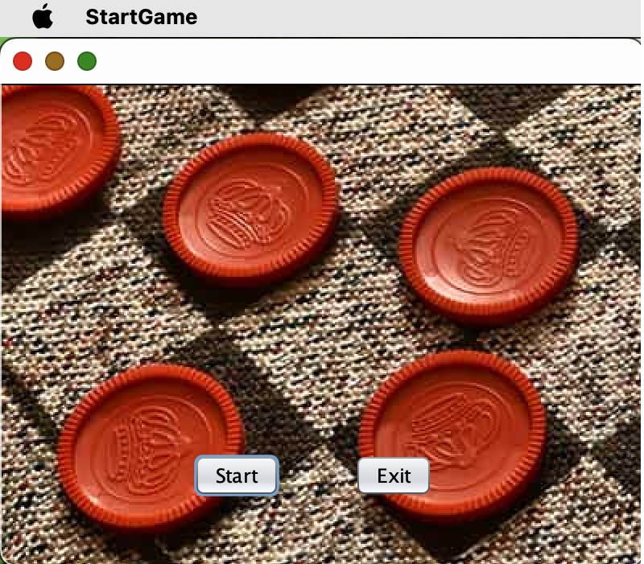
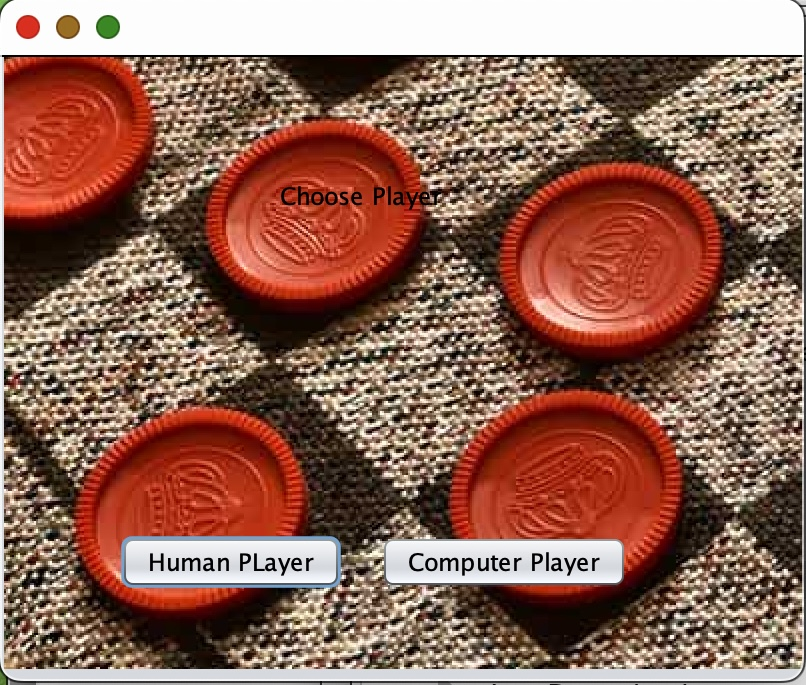
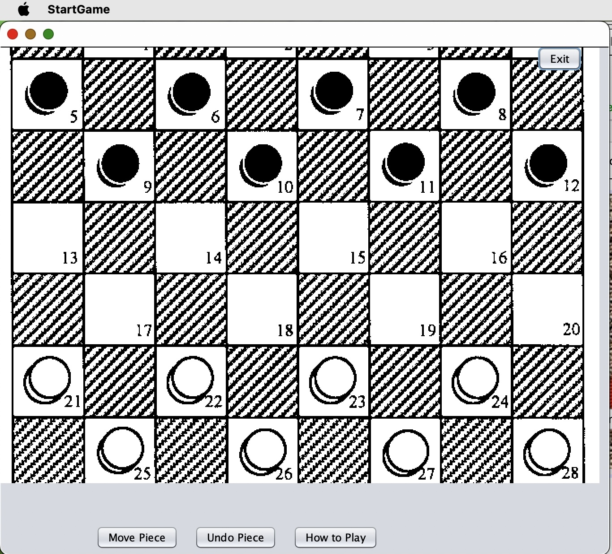

# Table of Contents

1. 	Introduction 
		1.1 Purpose 
		1.2 Document Conventions  
      	1.3 Intended Audience and Reading Suggestions 
      	1.4 Project Scope 
      	1.5 References 
2.	Overall Description 
		2.1 Product Perspective 
		2.2 Product Features 
		2.3	User Classes and Characteristics 
		2.4 Operating Environment 
		2.5 Design and Implementation Constraints 
3.	System Features 
		3.1 Multiplayer 
		3.2 Stalemate/draw Detection 
		3.3 Confirm/undo Move 
4.	External Interface Requirements 
		4.1 User Interfaces 
		4.2 Hardware Interfaces 
		4.3 Software Interfaces 
		4.4 Communication Interfaces 
5.	Other Nonfunctional Requirements 
		5.1 Performance Requirements 
		5.2 Safety Requirements 
		5.3 Security Requirements 
		5.4 Software Quality Attributes 
6.	Other Requirements 

Appendix A: Glossary 
Appendix B: Analysis Models 
Appendix C: Issues List 

# **1. Introduction**
## **1.1 Purpose**  
This Software Requirements Specification document is intended to demonstrate the (partial or whole) utter outline of the computer-based game project Checkers, including game mechanics, user interface, and user experience. The SRS list includes all the characteristics Checkers have and those that are crucial to their application. 
## **1.2 Document Conventions**  
There is a disparity between player_1 and player_2. Player 2 can be the character that is being controlled by another person or a CPU player. Whereas player_1 is always an actual person engaging with the game. The SRS documentation printed in Times New Roman font with the normal text size 12 black. 
## **1.3 Intended Audience and Reading Suggestions**  
The SRS paper also explains project managers and tests a mechanism to make sure that the game stays true to the original version. The text was prepared in segments and may therefore be viewed as such to fully grasp the project. The overall description for a summary of the document might be viewed in Section 2. The System features provide a thorough explanation of the gaming components and how they relate to each other and can be viewed in Section 3. The additional non-functional requirements outline the technical standards the team will adhere to the project in Section 5.
## **1.4 Project Scope**  
This system's scope is to create a checkers gaming platform using the NetBeans GUI interface. The system will support the game with multiple players including a CPU player. On opposite ends of the gaming board, two opponents play the game of checkers. Players 1 and 2 each have a set of dark and light pieces.  Player’s switch turns. An opponent's pieces cannot be moved by a player. The support for the fundamental set of features (multiplayer, CPU), as well as the simplicity of developing game comprehension, are advantages of creating this game. This game is available for low-memory devices. 
## **1.5 References**  
Game Instructions: https://en.wikipedia.org/wiki/Checkers#General_rules

# **2. Overall Description**
## **2.1 Product Perspective**  
This product is a replacement for certain existing systems. The consumer can alter the game's state by interacting with it while offline. The user's device must support Java 8 or later versions.
## **2.2 Product Features**  
This product will have a fully playable Checkers game. It will have a simple multiplayer feature that allows the user to play against another human or a CPU player. The program will also include an easily understandable user interface. 
## **2.3 User Classes and Characteristics**  
We anticipate that this product will be primarily used by a younger audience with a basic level of literacy. Our product can also be used by people of older ages as well, but the simplicity may not be as appealing or necessary for that user class.
## **2.4 Operating Environment**  
Our software will be runnable on operating systems compatible with Java 8 and above.
## **2.5 Design and Implementation Constraints**  
Acquiring requirements and developing the game's software architecture make up the design phase. Throughout the implementation phase, the phase will be reviewed multiple times. The iterative process of developing the game is what makes up the implementation phase. The overall architecture should be put into practice before writing the actual code, tests, and comprehensive documentation. There will be several sprints during the implementation phase.
## **2.6 User Documentation**  
The user can learn how to play checkers using several online resources, such as https://en.wikipedia.org/wiki/Checkers#General_rules
## **2.7 Assumptions and Dependencies**  
<ul>
	<li>Users have a device capable of running java 8 or later versions.
		<ul>
			<li>The user's device needs to be quick enough to handle java files if that is not possible.</li>
		</ul>
	</li>
	<li>Plan where and how to store data from the user.</li>
</ul>  

# **3. System Features**
## **3.1 Multiplayer**
### **3.1.1 Description and Priority**  
The user should be able to play against another person or a CPU player. This feature is of high priority. 
### **3.1.2 Functional Requirements**  
REQ-1: Player selection
## **3.2 Stalemate/draw Detection**
### **3.2.1 Description and Priority**  
The game should be able to detect if there are no possible moves remaining, then proceed by either declaring a winner or a draw. This feature is a high priority.
### **3.2.2 Functional Requirements**  
REQ-2: Check if any valid moves are remaining from either player.  
REQ-3: Count the number of remaining pieces each player has on the board.  
## **3.3 Confirm/undo Move**
### **3.3.1 Description and Priority**  
The player should be able to confirm or undo their move before the next player’s turn.
### **3.3.2 Functional Requirements**  
REQ-4: The player should be able to move their piece.  
REQ-5: Store the last position of the pieces for the undo function.  

# **4. External Interface Requirements**
## **4.1 User Interfaces**  
There will be a start game button, restart button, help button, and exit game button. There will also be a full-sized checkers board in the center of the application.  
  
  
  

## **4.2 Hardware Interfaces**  
Supported devices include desktop and laptop computers.
## **4.3 Software Interfaces**  
Checkers game is to be developed for devices that support Java 8 or later versions using a game development tool.  
<ul>
	<li>NetBeans: primary game development library using GUI</li>
</ul>
## **4.4 Communications Interfaces**  
<ul>
	<li>HTTP/HTTPS</li>
	<li>xxx@checkers-website.com - domain-oriented email address.</li>
</ul>

# **Other Nonfunctional Requirements**
